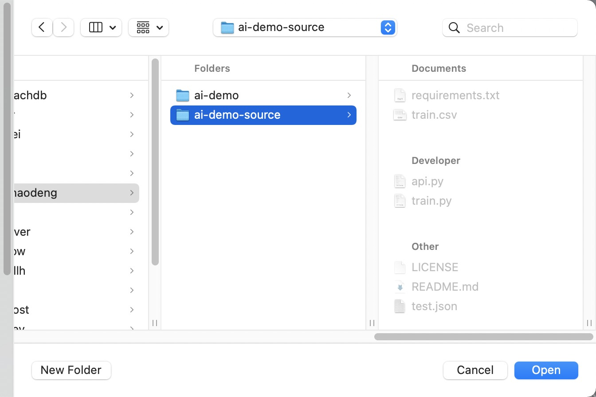

# AI App Cloud Native Best Practice 

This contains the deployment code that builds and deploy an [AI application](https://github.com/hongchaodeng/ai-demo-source).

## Prerequisite

- Kubernetes cluster ready
- [kube-prometheus](https://prometheus-operator.dev/docs/prologue/quick-start/) installed

## Quickstart

Run the following command to set up a Dagger environment:

```
dagger init
dagger new test -p plans/ai-demo
```

Then input user values:

> NOTE: You need to specify $KUBECONFIG, your own docker image name and credentials.

```
dagger input yaml parameters -f app.yaml
dagger input text kubeconfig -f ${KUBECONFIG}
dagger input text push.target ghcr.io/hongchaodeng/ai-demo
dagger input text push.auth.username hongchaodeng
dagger input secret push.auth.secret ${GITHUB_TOKEN}
```

Then it runs the following command to build and deploy the app to k8s:

```
dagger up
```

Output:

```
[✔] image
[✔] push.source
[✔] push.push
[✔] applyResources."0"
[✔] applyResources."1"
[✔] applyResources."2"
[✔] applyResources."3"
[✔] applyResources."4"
[✔] patchGrafana
Output                                                                                        Value                                                                                                          Description
generateResource."apps/v1:Deployment:default:ai-demo".spec.template.spec.containers[0].image  "ghcr.io/hongchaodeng/ai-demo:latest@sha256:ab8f456c53c2938e81914250aab0d862f7ee6568e6767c8dafd6be818dc0bbcd"  -
resources[0].spec.template.spec.containers[0].image                                           "ghcr.io/hongchaodeng/ai-demo:latest@sha256:ab8f456c53c2938e81914250aab0d862f7ee6568e6767c8dafd6be818dc0bbcd"  -
push.ref                                                                                      "ghcr.io/hongchaodeng/ai-demo:latest@sha256:ab8f456c53c2938e81914250aab0d862f7ee6568e6767c8dafd6be818dc0bbcd"  Image ref
push.digest                                                                                   "sha256:ab8f456c53c2938e81914250aab0d862f7ee6568e6767c8dafd6be818dc0bbcd"                                      Image digest
```

### Workload

The above workflow creates a Deployment. Run:

```
kubectl get deploy
```

Output:
```
NAME      READY   UP-TO-DATE   AVAILABLE   AGE
ai-demo   1/1     1            1           41m
```

### Networking

The above workflow creates an Ingress and Service. Run:

```
kubectl get ingress
kubectl get service
```

Output:

```
NAME      CLASS   HOSTS   ADDRESS        PORTS   AGE
ai-demo   nginx   *       11.111.11.11   80      14d


NAME         TYPE        CLUSTER-IP        EXTERNAL-IP   PORT(S)    AGE
ai-demo      ClusterIP   192.168.198.217   <none>        5000/TCP   14d
```

### Autoscaling

The above workflow creates a HorizontalPodAutoscaling. Run:

```
kubectl get hpa
```

Output:
```
NAME      REFERENCE            TARGETS   MINPODS   MAXPODS   REPLICAS   AGE
ai-demo   Deployment/ai-demo   2%/80%    1         5         1          8d
```

### Observability

Port forward to grafana endpoint:

```
kubectl --namespace monitoring port-forward svc/grafana 3000
```

We should see that it automatically creates a dashboard for the application:


### Debug Remotely

> Install [Nocalhost VSCode plugin](https://nocalhost.dev/docs/quick-start/) first

In VSCode, Open Nocalhost panel, select the `ai-demo` Deployment to start dev-container:


Click the green hammer button, choose `Open associated directory`, select the corresponding source code dir:



Then it will open an IDE with the source code running on remote container:


## Add a new capability

The [autoscaling.cue](./plans/ai-demo/autoscaling.cue) is an example to add a new capability to existing definitions:

```
package ml

// Dynamically adds a capability and exposes the parameters to the app.
parameters: #deploy: scaling:
	{
		auto: {
			min:        int
			max:        int
			cpuPercent: int
		}
	} | {
		manual: replicas: int
	}

if parameters.deploy.scaling.auto != _|_ {
	generateResource: "autoscaling/v1:HorizontalPodAutoscaler:\(parameters.metadata.namespace):\(parameters.metadata.name)": {
		apiVersion: "autoscaling/v1"
		kind:       "HorizontalPodAutoscaler"
		...
	}
}

if parameters.deploy.scaling.manual != _|_ {
  // directly updates the deployment resource's replicas
	generateResource: "apps/v1:Deployment:\(parameters.metadata.namespace):\(parameters.metadata.name)": spec: replicas: parameters.deploy.scaling.manual.replicas
}
```
